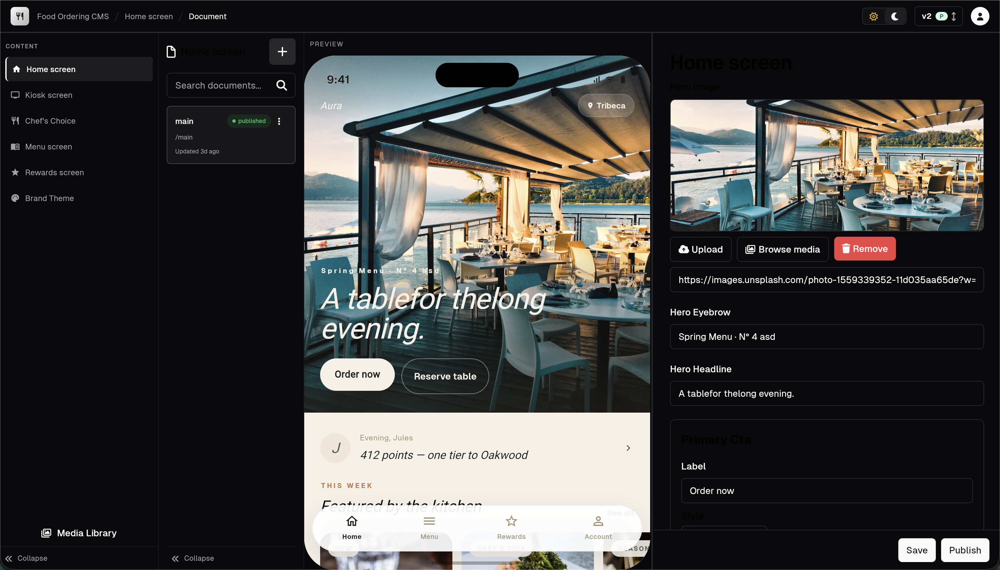

# dart_desk

A schema-driven CMS studio for Flutter. Define your content as annotated Dart classes, get a full editing UI, and consume the published JSON from any Dart/Flutter app.

> ⚠️ **Rapid development.** APIs may shift between minor versions.
> Bug reports and feature requests are very welcome — please open an issue at
> [github.com/ThangVuNguyenViet/dart_desk/issues](https://github.com/ThangVuNguyenViet/dart_desk/issues).



## How it works

Walk through the full loop with one example — a `StorefrontConfig` for a restaurant app.

### 1. Define a DeskModel

```dart
// storefront_config.dart
import 'package:dart_desk_annotation/dart_desk_annotation.dart';
import 'package:dart_mappable/dart_mappable.dart';
import 'package:flutter/material.dart';

part 'storefront_config.desk.dart';
part 'storefront_config.mapper.dart';

@DeskModel(title: 'Storefront', description: 'Restaurant home screen')
@MappableClass(includeCustomMappers: [ImageReferenceMapper()])
class StorefrontConfig with StorefrontConfigMappable {
  @DeskString(option: DeskStringOption())
  final String restaurantName;

  @DeskImage(option: DeskImageOption(hotspot: true))
  final ImageReference? heroImage;

  @DeskColor(option: DeskColorOption())
  final Color primaryColor;

  @DeskArray(option: DeskArrayOption())
  final List<MenuHighlight> highlights;

  const StorefrontConfig({
    required this.restaurantName,
    required this.primaryColor,
    required this.highlights,
    this.heroImage,
  });
}

@DeskObject(option: DeskObjectOption())
class MenuHighlight with MenuHighlightMappable {
  @DeskString(option: DeskStringOption())
  final String name;

  @DeskImage(option: DeskImageOption())
  final ImageReference? image;

  const MenuHighlight({required this.name, this.image});
}
```

### 2. Run the generator

```bash
dart run build_runner build
```

This emits `storefront_config.desk.dart` containing `storefrontConfigTypeSpec` — a `DocumentTypeSpec` your studio can wire up.

### 3. Run the studio

```dart
// main.dart
import 'package:dart_desk/dart_desk.dart';
import 'package:dart_desk/studio.dart';
import 'package:flutter/material.dart';
import 'storefront_config.desk.dart';

void main() {
  final storefrontType = storefrontConfigTypeSpec.build(
    builder: (data) {
      final merged = {...StorefrontConfig.defaultValue.toMap(), ...data};
      return StorefrontPreview(config: StorefrontConfigMapper.fromMap(merged));
    },
  );

  runApp(DartDeskApp.withDataSource(
    dataSource: myDataSource, // CloudDataSource or your own DataSource
    onSignOut: () { /* ... */ },
    config: DartDeskConfig(
      documentTypes: [storefrontType],
      title: 'My Studio',
      icon: Icons.restaurant,
    ),
  ));
}
```

### 4. Consume in your real app

Production apps read published content via the public read API on
[`dart_desk_client`](https://pub.dev/packages/dart_desk_client). No auth
required for default content.

```dart
import 'dart:convert';
import 'package:dart_desk_client/dart_desk_client.dart';
import 'storefront_config.dart';

final client = Client('https://your-project.dartdesk.dev/');

Future<StorefrontConfig> loadStorefront() async {
  final docs = await client.publicContent.getDefaultContents();
  final raw = docs['storefront']!.data;
  return StorefrontConfigMapper.fromMap(jsonDecode(raw) as Map<String, dynamic>);
}
```

That's the full loop: model → generator → studio → consumer.

## Cloud quick start

1. Sign up at [manage.dartdesk.dev](https://manage.dartdesk.dev).
2. `dart pub global activate dart_desk_cli`
3. `dartdesk login && dartdesk deploy`

Full docs at [dartdesk.dev](https://dartdesk.dev).

## Self-host

Run your own backend by pointing `DartDeskApp` at a [dart_desk_be](https://github.com/ThangVuNguyenViet/dart_desk_be) Serverpod instance, or implement `DataSource` directly to plug into Firebase, Supabase, your own API, or anything else you can call from Dart.

## Features

- Schema-driven content modeling — annotated Dart classes are the source of truth
- 16 built-in field types (text, rich text, image with hotspot, color, geopoint, array, nested object, …)
- Document version history with draft/published/scheduled/archived workflow
- Media browser with drag-and-drop upload, BlurHash placeholders, hotspot/crop editor
- Live preview — render any Flutter widget alongside the editor form
- BYO backend — implement `DataSource` for any data layer
- Theming via [shadcn_ui](https://pub.dev/packages/shadcn_ui), reactive state via [signals](https://pub.dev/packages/signals)

## Related packages

| Package | Purpose |
|---------|---------|
| [`dart_desk_annotation`](https://pub.dev/packages/dart_desk_annotation) | Field annotations |
| [`dart_desk_generator`](https://pub.dev/packages/dart_desk_generator) | Code generator |
| [`dart_desk_cli`](https://pub.dev/packages/dart_desk_cli) | CLI for Dart Desk Cloud |
| [`dart_desk_client`](https://pub.dev/packages/dart_desk_client) | Runtime client for fetching published content |

## License

BSD 3-Clause — see [LICENSE](LICENSE).
